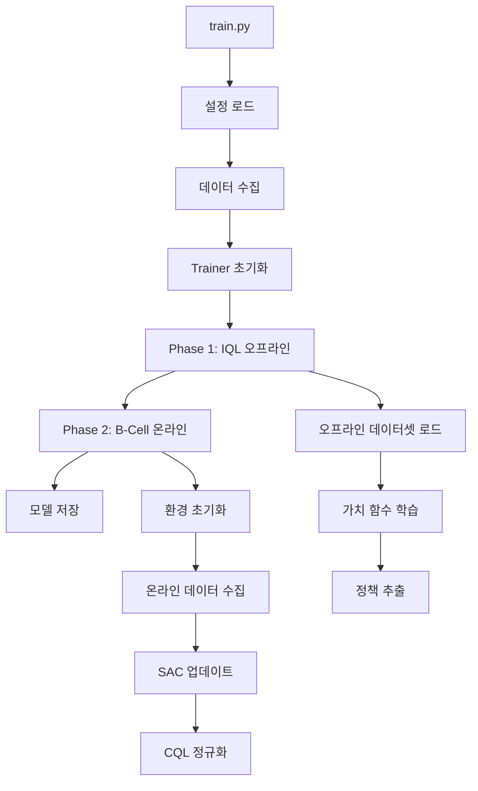
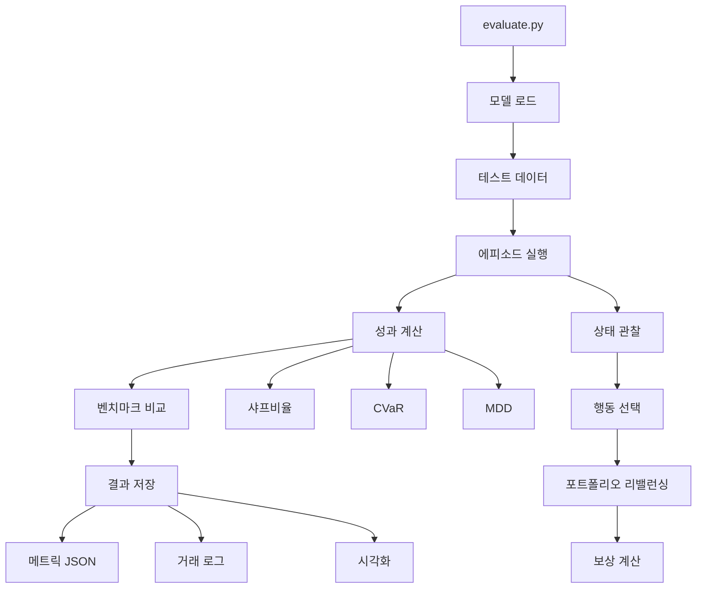
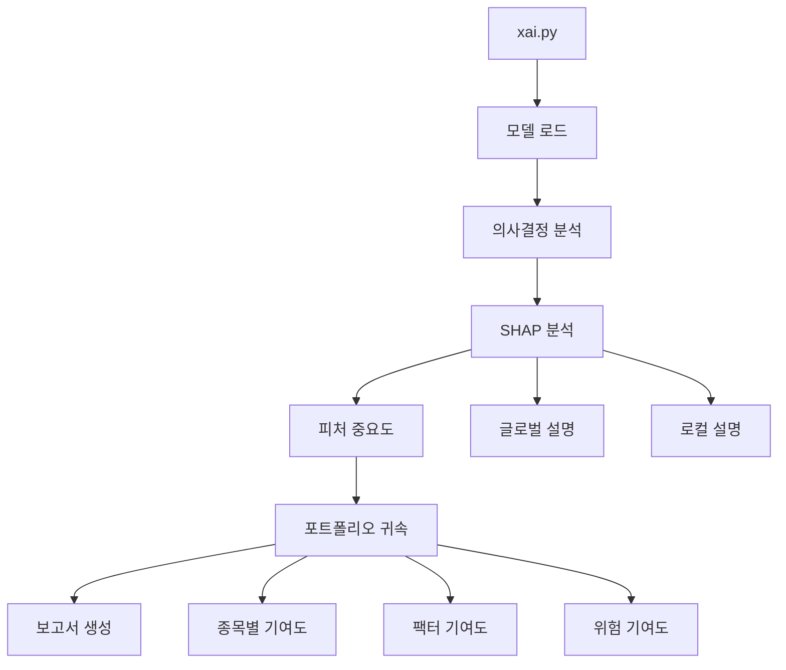

# ARCHITECTURE.md

## FinFlow-RL 프로젝트 아키텍처

FinFlow-RL (BIPD 2.0)는 생물학적 영감을 받은 포트폴리오 관리 시스템으로, IQL→SAC 파이프라인을 활용한 설명 가능한 AI 기반 투자 의사결정 시스템이다.

## 📁 프로젝트 구조

```
FinFlow-rl/
├── configs/          # 설정 파일
├── scripts/          # 실행 스크립트
├── src/              # 소스 코드
│   ├── agents/       # 강화학습 에이전트
│   ├── analysis/     # 분석 도구
│   ├── core/         # 핵심 모듈
│   ├── data/         # 데이터 처리
│   └── utils/        # 유틸리티
├── tests/           # 테스트
└── logs/            # 실행 로그
```

## 🗂️ 파일별 상세 설명

### 📂 src/agents/ (4개 파일)

#### 1. `b_cell.py` (1073 lines)
**핵심 에이전트** - IQL + Distributional SAC 통합 구현
- **IQL 오프라인 사전학습**: 안정적인 가치 함수 학습
- **Distributional SAC**: 분위수 크리틱과 CQL 정규화
- **Multi-Expert System**: 5가지 전문 전략 (변동성, 상관관계, 모멘텀, 방어, 성장)
- **SafeTensors 통합**: 안전한 모델 직렬화
- **의존성**: core/networks.py, core/replay.py

#### 2. `memory.py` (402 lines)
**경험 메모리 관리** - k-NN 기반 검색
- **Prioritized Experience Replay**: TD 오류 기반 샘플링
- **k-NN 검색**: 유사한 시장 상황 검색 (k=5)
- **메타데이터 추적**: 시장 레짐, 위기 상황, 성능 지표
- **의존성**: 독립적

#### 3. `meta.py` (406 lines)
**메타 학습** - 적응형 파라미터 조정
- **Hypernetwork**: 시장 상태에 따른 동적 파라미터 생성
- **적응형 스케줄링**: 학습률, 탐험률 자동 조정
- **레짐 감지**: 시장 상태 변화 감지
- **의존성**: memory.py

#### 4. `t_cell.py` (275 lines)
**위기 감지 시스템** - Isolation Forest + SHAP
- **이상치 탐지**: Isolation Forest로 비정상 패턴 감지
- **SHAP 설명**: 위기 신호의 원인 분석
- **다중 타임스케일**: 단기/중기/장기 위기 평가
- **의존성**: 독립적

### 📂 src/analysis/ (3개 파일)

#### 5. `backtest.py` (521 lines)
**현실적 백테스팅** - 거래 비용 모델링
- **거래 비용**: 슬리피지, 시장 충격, 세금
- **포지션 제약**: 공매도, 레버리지 제한
- **성과 지표**: 샤프비율, CVaR, MDD
- **통합 상태**: evaluate.py에 통합됨

#### 6. `monitor.py` (325 lines)
**실시간 성능 모니터링** - 대시보드
- **TensorBoard 통합**: 학습 곡선 시각화
- **실시간 지표**: 포트폴리오 가치, 위험 메트릭
- **경고 시스템**: 임계값 초과시 알림
- **의존성**: utils/monitoring.py

#### 7. `xai.py` (541 lines)
**설명 가능한 AI** - SHAP/LIME 통합
- **SHAP 분석**: 피처 중요도, 의사결정 설명
- **LIME**: 로컬 설명 생성
- **포트폴리오 귀속**: 수익 기여도 분석
- **의존성**: t_cell.py

### 📂 src/core/ (11개 파일)

#### 8. `env.py` (686 lines)
**거래 환경** - T+1 결제 시뮬레이션
- **상태 공간**: 43차원 (시장 12D + 포트폴리오 30D + 위기 1D)
- **행동 공간**: Dirichlet 정책으로 유효한 포트폴리오 가중치
- **보상 함수**: 수익률 + Differential Sharpe - CVaR 페널티
- **의존성**: data/loader.py, objectives.py

#### 9. `iql.py` (503 lines)
**IQL 구현** - 오프라인 RL
- **Implicit Q-Learning**: 중요도 샘플링 없는 오프라인 학습
- **기대값 정규화**: 오프라인 데이터 분포 보정
- **네트워크**: core/networks.py 임포트
- **의존성**: networks.py, offline_dataset.py

#### 10. `networks.py` (597 lines)
**신경망 아키텍처** - 공통 네트워크
- **QNetwork**: 분위수 크리틱 (256-256-128)
- **PolicyNetwork**: Dirichlet 정책 네트워크
- **ValueNetwork**: 가치 함수 네트워크
- **의존성**: 독립적

#### 11. `objectives.py` (403 lines)
**목적 함수** - 위험 조정 수익
- **Differential Sharpe**: 온라인 샤프비율 최적화
- **CVaR 제약**: 꼬리 위험 제한
- **거래 비용**: 회전율 페널티
- **의존성**: 독립적

#### 12. `offline_dataset.py` (224 lines)
**오프라인 데이터셋** - 기본 구현
- **데이터 로딩**: npz 파일 로드
- **배치 샘플링**: 균일 샘플링
- **정규화**: z-score 정규화
- **의존성**: 독립적

#### 13. `replay.py` (532 lines)
**리플레이 버퍼** - 확장 구현
- **ReplayOfflineDataset**: 향상된 오프라인 데이터셋
- **PrioritizedReplay**: TD 오류 기반 우선순위
- **세그먼트 트리**: 효율적인 샘플링
- **의존성**: offline_dataset.py

#### 14. `trainer.py` (1147 lines)
**학습 파이프라인** - 메인 훈련 루프
- **Phase 1**: IQL 오프라인 사전학습
- **Phase 2**: B-Cell 온라인 미세조정
- **체크포인팅**: 모델 저장/복구
- **의존성**: iql.py, agents/b_cell.py, env.py

#### 15. `buffer.py` (423 lines)
**경험 버퍼** - 온라인 학습
- **리플레이 버퍼**: 경험 저장
- **우선순위 샘플링**: TD 오류 기반
- **n-step 리턴**: 부트스트래핑
- **의존성**: 독립적

#### 16. `distributional.py` (312 lines)
**분포적 RL** - 분위수 회귀
- **Quantile Regression**: 리턴 분포 학습
- **위험 민감 정책**: CVaR 기반 의사결정
- **불확실성 추정**: 에피스테믹 불확실성
- **의존성**: networks.py

#### 17. `soft_moe.py` (398 lines)
**Soft Mixture of Experts** - 전문가 시스템
- **5개 전문가**: 각 시장 상황별 특화
- **게이팅 네트워크**: 전문가 가중치 결정
- **소프트 라우팅**: 미분 가능한 전문가 선택
- **의존성**: networks.py

#### 18. `tuning.py` (독립 도구)
**하이퍼파라미터 튜닝** - Optuna 통합
- **베이지안 최적화**: 효율적인 파라미터 탐색
- **다중 목표**: 샤프비율과 안정성 동시 최적화
- **교차 검증**: 과적합 방지
- **의존성**: trainer.py

### 📂 src/data/ (2개 파일)

#### 19. `features.py` (367 lines)
**피처 엔지니어링** - 기술적 지표
- **기술 지표**: RSI, MACD, 볼린저 밴드
- **시장 마이크로구조**: 스프레드, 깊이, 거래량
- **매크로 팩터**: 금리, VIX, 달러 지수
- **의존성**: loader.py

#### 20. `loader.py` (511 lines)
**데이터 로딩** - yfinance 통합
- **실시간 데이터**: yfinance API
- **캐싱 시스템**: 로컬 저장소
- **전처리**: 결측치, 이상치 처리
- **의존성**: 독립적

### 📂 src/utils/ (4개 파일)

#### 21. `constants.py` (121 lines)
**상수 정의** - 전역 설정
- **데이터 경로**: 디렉토리 구조
- **하이퍼파라미터**: 기본값
- **시장 상수**: 거래 시간, 수수료
- **의존성**: 독립적

#### 22. `logger.py` (342 lines)
**로깅 시스템** - FinFlowLogger
- **세션 기반**: YYYYMMDD_HHMMSS 디렉토리
- **이중 로깅**: 콘솔(INFO) + 파일(DEBUG)
- **메트릭 추적**: metrics.jsonl
- **의존성**: 독립적

#### 23. `metrics.py` (289 lines)
**성과 지표** - 평가 메트릭
- **위험 지표**: 샤프, 소르티노, 칼마, CVaR
- **수익 지표**: 연환산 수익률, 알파, 베타
- **거래 지표**: 회전율, 승률, 손익비
- **의존성**: 독립적

#### 24. `monitoring.py` (187 lines)
**시스템 모니터링** - 리소스 추적
- **GPU/CPU 사용률**: 실시간 모니터링
- **메모리 추적**: 누수 감지
- **학습 진행**: ETA, 처리량
- **의존성**: 독립적

### 📂 scripts/ (3개 파일)

#### 25. `train.py` (145 lines)
**학습 스크립트** - 메인 엔트리
- **CLI 인터페이스**: argparse
- **설정 로드**: YAML 파싱
- **학습 실행**: Trainer 초기화 및 실행
- **의존성**: core/trainer.py

#### 26. `evaluate.py` (893 lines)
**평가 스크립트** - 성능 평가
- **백테스팅**: 히스토리컬 성과
- **위험 분석**: 드로우다운, VaR
- **벤치마크 비교**: 균등 가중 포트폴리오
- **현실적 백테스트 통합**: RealisticBacktester
- **의존성**: core/env.py, analysis/backtest.py

#### 27. `collect_offline_data.py` (328 lines)
**오프라인 데이터 수집** - 사전학습 데이터
- **데이터 다운로드**: yfinance
- **피처 생성**: 기술적 지표
- **저장**: NPZ 형식
- **의존성**: data/loader.py, data/features.py

## 🔄 메인 파이프라인

### 1️⃣ 학습 파이프라인 (Training Pipeline)



**실행 흐름:**
1. `scripts/train.py` 실행
2. `configs/default.yaml` 설정 로드
3. `FinFlowTrainer` 초기화 (core/trainer.py)
4. **Phase 1**: IQL 오프라인 사전학습
   - `OfflineDataset` 로드 (core/offline_dataset.py)
   - `IQL` 가치 함수 학습 (core/iql.py)
   - 안정적인 정책 추출
5. **Phase 2**: B-Cell 온라인 미세조정
   - `BCell` 초기화 (agents/b_cell.py)
   - `PortfolioEnv` 환경 상호작용 (core/env.py)
   - Distributional SAC + CQL 업데이트
6. 모델 체크포인트 저장 (SafeTensors)

### 2️⃣ 평가 파이프라인 (Evaluation Pipeline)



**실행 흐름:**
1. `scripts/evaluate.py` 실행
2. 학습된 모델 로드 (SafeTensors)
3. `FinFlowEvaluator` 초기화
4. 테스트 기간 에피소드 실행
   - T-Cell 위기 감지 (agents/t_cell.py)
   - B-Cell 정책 실행 (agents/b_cell.py)
   - 포트폴리오 리밸런싱
5. 성과 지표 계산 (utils/metrics.py)
6. 벤치마크 대비 비교
7. **옵션**: `--with-backtest` 현실적 백테스트
   - `RealisticBacktester` 실행 (analysis/backtest.py)
   - 거래 비용, 슬리피지, 세금 반영
8. 결과 저장 및 시각화

### 3️⃣ XAI 분석 파이프라인 (Explainable AI Pipeline)



**실행 흐름:**
1. `XAIAnalyzer` 초기화 (analysis/xai.py)
2. 학습된 모델 및 거래 이력 로드
3. SHAP 분석 수행
   - 글로벌 피처 중요도
   - 개별 의사결정 설명
4. T-Cell 위기 신호 분석
5. 포트폴리오 수익 귀속
   - 종목별 기여도
   - 리스크 팩터 기여도
6. HTML/PDF 보고서 생성

## 🏗️ 아키텍처 결정 사항

### 1. IQL → SAC 파이프라인
- **이유**: 오프라인 데이터로 안정적 초기화 후 온라인 적응
- **장점**: Cold-start 문제 해결, 샘플 효율성 향상

### 2. Distributional RL + CQL
- **이유**: 불확실성 정량화 및 오프라인 RL 안정성
- **장점**: 위험 민감 의사결정, 분포 외 행동 억제

### 3. Multi-Expert System (Soft MoE)
- **이유**: 다양한 시장 상황에 특화된 전략
- **장점**: 시장 레짐별 최적 대응

### 4. T-Cell 위기 감지
- **이유**: 사전 위험 감지 및 방어적 포지셔닝
- **장점**: 큰 손실 방지, 해석 가능한 위기 신호

### 5. SafeTensors 사용
- **이유**: 보안 및 호환성
- **장점**: 안전한 모델 직렬화, 빠른 로드

## 📊 핵심 성과 지표

### 목표 성과
- **샤프비율**: ≥ 1.5
- **CVaR(5%)**: ≥ -0.02
- **최대낙폭**: ≤ 25%
- **연환산 수익률**: ≥ 15%
- **회전율**: ≤ 2.0

### 벤치마크
- **균등 가중 포트폴리오**: 기본 비교
- **S&P 500**: 시장 대비 성과
- **Buy & Hold**: 패시브 전략 대비

## 🔧 확장 가능성

### 계획된 개선사항
1. **Transformer 통합**: 시계열 패턴 학습
2. **연합 학습**: 다중 클라이언트 학습
3. **실시간 거래**: 브로커 API 통합
4. **멀티 자산**: 주식 외 자산 클래스

### 모듈화 설계
- 각 컴포넌트 독립적 교체 가능
- 표준 인터페이스 정의
- 플러그인 아키텍처

## 🐛 디버깅 가이드

### 일반적인 문제
1. **메모리 부족**: 배치 크기 감소
2. **학습 불안정**: 학습률 조정, CQL 가중치 증가
3. **과적합**: 드롭아웃 증가, 정규화 강화

### 로그 위치
- 학습 로그: `logs/YYYYMMDD_HHMMSS/train.log`
- 메트릭: `logs/YYYYMMDD_HHMMSS/metrics.jsonl`
- 체크포인트: `logs/YYYYMMDD_HHMMSS/checkpoints/`

## 📝 참고사항

### 의존성 그래프
- **핵심 의존성**: env.py ← trainer.py ← train.py
- **데이터 플로우**: loader.py → features.py → env.py
- **에이전트 체인**: iql.py → b_cell.py (+ t_cell.py)

### 사용하지 않는 파일
- 모든 파일이 메인 파이프라인에서 직간접적으로 사용됨
- `tuning.py`는 별도 하이퍼파라미터 최적화시 사용
- `backtest.py`는 evaluate.py에 통합되어 사용

### 중복 제거 완료
- `sac.py` 삭제 (B-Cell이 상위 구현)
- 네트워크 정의 통합 (networks.py)
- 오프라인 데이터셋 명명 충돌 해결

---

*Last Updated: 2025-01-22*
*Version: 2.0.0 (BIPD)*