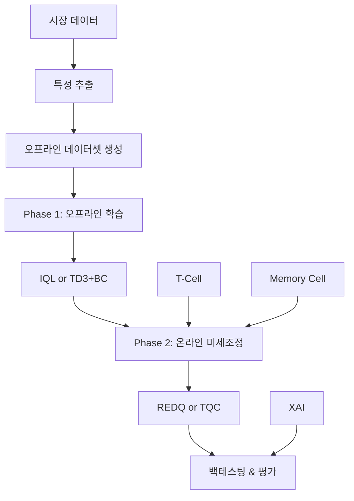

# FinFlow-RL 시스템 아키텍처

## 개요
FinFlow-RL은 생물학적 면역 시스템에서 영감을 받은 포트폴리오 관리 시스템으로, 오프라인 강화학습(IQL/TD3+BC)과 온라인 강화학습(REDQ/TQC)을 결합한 하이브리드 접근법을 사용한다.

## 프로젝트 구조

```
FinFlow-rl/
├── configs/                    # 설정 파일
│   ├── default.yaml            # 기본 설정
│   ├── test_1episode_td3bc.yaml  # TD3+BC 테스트
│   └── test_1episode_tqc.yaml    # TQC 테스트
│
├── src/                        # 소스 코드
│   ├── algorithms/             # 강화학습 알고리즘
│   │   ├── offline/            # 오프라인 RL
│   │   │   ├── iql.py          # Implicit Q-Learning
│   │   │   └── td3bc.py        # TD3 + Behavior Cloning
│   │   └── online/             # 온라인 RL
│   │       ├── b_cell.py       # REDQ/TQC 구현
│   │       ├── t_cell.py       # 위기 감지 시스템
│   │       └── memory.py       # 경험 재활용 메모리
│   │
│   ├── data/                   # 데이터 처리
│   │   ├── market_loader.py    # 시장 데이터 로더
│   │   ├── feature_extractor.py # 특성 추출
│   │   ├── offline_dataset.py  # 오프라인 데이터셋
│   │   ├── replay_buffer.py    # 리플레이 버퍼
│   │   └── data_validator.py   # 데이터 검증
│   │
│   ├── environments/           # 강화학습 환경
│   │   ├── portfolio_env.py    # 포트폴리오 거래 환경
│   │   └── reward_functions.py # 보상 함수
│   │
│   ├── evaluation/             # 평가 및 분석
│   │   ├── metrics.py          # 성능 메트릭
│   │   ├── backtester.py       # 백테스팅
│   │   ├── explainer.py        # XAI (SHAP)
│   │   ├── visualizer.py       # 시각화
│   │   └── monitor.py          # 실시간 모니터링
│   │
│   ├── models/                 # 신경망 모델
│   │   └── networks.py         # Actor/Critic 네트워크
│   │
│   ├── training/               # 학습 파이프라인
│   │   └── trainer.py          # 통합 학습기
│   │
│   ├── baselines/              # 베이스라인 전략
│   │   ├── equal_weight.py     # 균등 가중치
│   │   └── standard_sac.py     # 표준 SAC
│   │
│   ├── experiments/            # 실험 도구
│   │   ├── ablation.py         # 절제 연구
│   │   └── tuning.py           # 하이퍼파라미터 튜닝
│   │
│   └── utils/                  # 유틸리티
│       ├── logger.py           # 로깅 시스템
│       ├── device_manager.py   # 디바이스 관리
│       └── training_utils.py   # 학습 유틸리티
│
├── scripts/                    # 실행 스크립트
│   ├── train.py               # 학습 스크립트
│   └── evaluate.py            # 평가 스크립트
│
├── docs/                       # 문서
│   ├── API.md                 # API 레퍼런스
│   ├── TRAINING.md            # 학습 가이드
│   ├── EVALUATION.md          # 평가 가이드
│   ├── CONFIGURATION.md       # 설정 가이드
│   ├── XAI.md                 # 설명가능 AI
│   └── MAIN_USAGE.md          # main.py 사용법
│
├── logs/                       # 로그 (세션별)
│   └── YYYYMMDD_HHMMSS/       # 타임스탬프 디렉토리
│       ├── checkpoints/        # 모델 체크포인트
│       ├── results/            # 결과 파일
│       ├── tensorboard/        # TensorBoard 로그
│       └── visualizations/     # 시각화 결과
│
├── data/                       # 데이터
│   └── cache/                  # 캐시된 시장 데이터
│
├── tests/                      # 테스트
├── requirements.txt            # 의존성
├── main.py                     # 메인 엔트리포인트
└── README.md                   # 프로젝트 소개

```

## 핵심 컴포넌트

### 1. 생물학적 컴포넌트

#### T-Cell (위기 감지)
- **위치**: `src/algorithms/online/t_cell.py`
- **역할**: Isolation Forest를 사용한 시장 이상치 탐지
- **출력**: 0-1 범위의 위기 수준 점수

#### B-Cell (적응형 정책)
- **위치**: `src/algorithms/online/b_cell.py`
- **알고리즘**:
  - REDQ (Randomized Ensemble Double Q-learning)
  - TQC (Truncated Quantile Critics) - 새로 추가
- **특징**: T-Cell 신호에 따른 동적 리스크 조정

#### Memory Cell (경험 재활용)
- **위치**: `src/algorithms/online/memory.py`
- **역할**: k-NN 기반 유사 경험 검색 및 재활용
- **효과**: 샘플 효율성 향상

### 2. 학습 파이프라인



### 3. 알고리즘 선택

#### 오프라인 학습
- **IQL (Implicit Q-Learning)**: 안정적, 분포 외 행동 회피
- **TD3+BC**: 행동 복제 정규화를 통한 보수적 학습

#### 온라인 학습
- **REDQ**: 높은 UTD ratio (20), Q-앙상블 (10개)
- **TQC**: 분위수 회귀, 상위 분위수 제거로 보수적 추정

## 데이터 플로우

### 1. 데이터 수집
```
yfinance API → DataLoader → 캐싱 → FeatureExtractor
```

### 2. 특성 추출 (12차원)
- 기술적 지표: RSI, MACD, 볼린저 밴드
- 시장 구조: 변동성, 상관관계
- 모멘텀: 수익률, 이동평균

### 3. 상태 공간 (43차원)
- 시장 특성: 12D
- 현재 포트폴리오: 30D (다우존스 30)
- 위기 수준: 1D

### 4. 행동 공간
- Dirichlet 정책으로 유효한 포트폴리오 가중치 생성
- Simplex 제약: Σw_i = 1, w_i ≥ 0

## 성능 목표

| 메트릭 | 목표 | 설명 |
|--------|------|------|
| Sharpe Ratio | ≥ 1.5 | 위험 조정 수익률 |
| Max Drawdown | ≤ 25% | 최대 손실 |
| CVaR (95%) | ≥ -2% | 꼬리 위험 |
| 회전율 | ≤ 200%/년 | 거래 비용 제어 |

## 로깅 구조

모든 실행은 타임스탬프별 세션 디렉토리에 저장:

```
logs/20250923_170000/
├── finflow_training.log    # 상세 로그
├── metrics.jsonl           # 학습 메트릭
├── checkpoints/            # 모델 체크포인트
│   ├── episode_10.pt
│   ├── t_cell_10.pkl
│   └── memory_10.pkl
├── results/                # 최종 결과
│   └── final_results.json
├── tensorboard/            # TensorBoard 로그
└── visualizations/         # 그래프 및 차트
```

## 설정 시스템

### 우선순위
1. 명령줄 인자 (최우선)
2. 설정 파일 (--config)
3. 기본값

### 주요 설정 파일
- `default.yaml`: 프로덕션 설정
- `test_1episode_*.yaml`: 빠른 테스트용
- 사용자 정의 YAML 지원

## 알고리즘 조합 매트릭스

### 오프라인/온라인 조합

시스템은 4가지 오프라인/온라인 알고리즘 조합을 지원한다:

```
                 온라인 학습
                ┌─────────────┬─────────────┐
                │    REDQ     │     TQC     │
    ┌───────────┼─────────────┼─────────────┤
오  │    IQL    │  IQL+REDQ   │  IQL+TQC    │
프  │           │  (안정성)   │  (리스크)   │
라  ├───────────┼─────────────┼─────────────┤
인  │   TD3BC   │ TD3BC+REDQ  │ TD3BC+TQC   │
    │           │  (성능)     │  (속도)     │
    └───────────┴─────────────┴─────────────┘
```

### 알고리즘 구조

```
src/algorithms/
├── offline/              # 오프라인 사전학습
│   ├── iql.py           # IQLAgent 클래스
│   └── td3bc.py         # TD3BCAgent 클래스
│
└── online/              # 온라인 미세조정
    └── b_cell.py        # BCell 클래스 (REDQ/TQC)
```

### 알고리즘 선택 플로우

```python
# trainer.py에서의 알고리즘 선택
if config['offline']['method'] == 'iql':
    offline_agent = IQLAgent(...)
elif config['offline']['method'] == 'td3bc':
    offline_agent = TD3BCAgent(...)

if config['bcell']['algorithm'] == 'REDQ':
    online_agent = BCell(..., use_redq=True)
elif config['bcell']['algorithm'] == 'TQC':
    online_agent = BCell(..., use_tqc=True)
```

## 확장 포인트

### 새 알고리즘 추가
1. `src/algorithms/`에 구현
2. `BCell`에 통합 또는 독립 에이전트로
3. 설정 파일에 파라미터 추가
4. `trainer.py`에서 선택 로직 구현

### 새 베이스라인 추가
1. `src/baselines/`에 구현
2. PortfolioEnv와 호환되는 인터페이스
3. 성능 비교 테이블에 추가

### 새 특성 추가
1. `FeatureExtractor`에 추출 로직
2. 특성 차원 업데이트
3. 정규화 및 검증 추가

## 의존성

### 핵심 라이브러리
- PyTorch ≥ 1.12
- NumPy, Pandas
- yfinance (데이터)
- scikit-learn (T-Cell)

### 선택적
- TensorBoard
- SHAP (XAI)
- Optuna (튜닝)
- Plotly (시각화)

## 디버깅 팁

### 일반적인 문제
1. **NaN/Inf 값**: 보상 스케일링, 그래디언트 클리핑 확인
2. **메모리 부족**: 배치 크기, 버퍼 크기 감소
3. **학습 불안정**: 학습률 감소, 정규화 강화
4. **낮은 성능**: 특성 품질, 하이퍼파라미터 튜닝

### 유용한 로그
- `logs/*/finflow_training.log`: 상세 디버그 정보
- `logs/*/metrics.jsonl`: 에포크별 성능 추적
- TensorBoard: 실시간 학습 곡선

## 연락처

문제 발생시 GitHub Issues에 보고:
https://github.com/anthropics/finflow-rl/issues